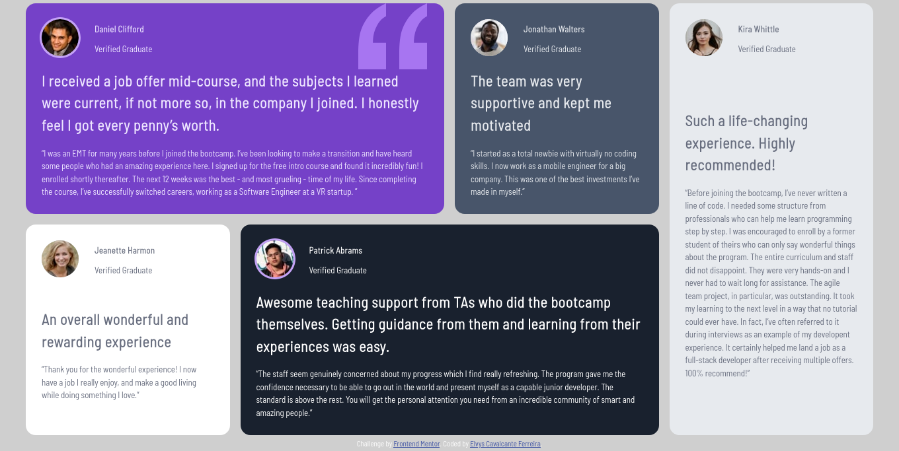
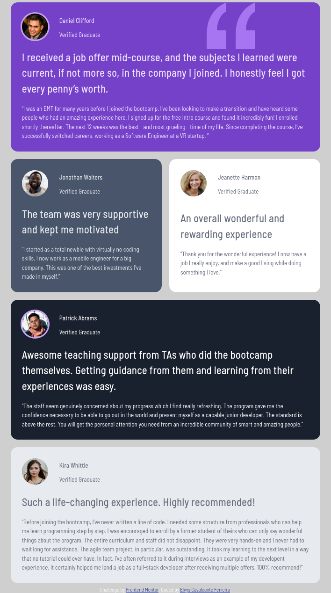

# Frontend Mentor - Testimonials grid section solution

This is a solution to the [Testimonials grid section challenge on Frontend Mentor](https://www.frontendmentor.io/challenges/testimonials-grid-section-Nnw6J7Un7). Frontend Mentor challenges help you improve your coding skills by building realistic projects. 

## Table of contents

- [Overview](#overview)
  - [The challenge](#the-challenge)
  - [Screenshot](#screenshot)
  - [Links](#links)
- [My process](#my-process)
  - [Built with](#built-with)
  - [What I learned](#what-i-learned)
  - [Continued development](#continued-development)
- [Author](#author)

## Overview

### The challenge

Users should be able to:

- View the optimal layout for the site depending on their device's screen size

### Screenshot





### Links

- Solution URL: [https://github.com/Elvys-c/testimonials-grid-section](https://github.com/Elvys-c/testimonials-grid-section)
- Live Site URL: [https://elvys-c.github.io/testimonials-grid-section/](https://elvys-c.github.io/testimonials-grid-section/)

## My process

  After analyzing the design images, I started organizing the card structures (header and text). Then, I applied the styles and adjusted the layout according to the screen size.

### Built with

- Semantic HTML5 markup
- CSS custom properties
- CSS Grid
- Mobile-first workflow

### What I learned

I learned how to use css grid-template-areas resource to define html elements with precision. This feature facilitates layout organization whenever screen size changes.

```css
.main {
  display: grid;
   grid-template-areas:
        "testimoni1 testimoni1 testimoni2 testimoni5"
        "testimoni3 testimoni4 testimoni4 testimoni5"
    ;
}

.card-header {
    display: grid;
    grid-template-areas: 
    "image name"
    "image verified";
}

```

### Continued development

I want to focus on making HTML elements responsive according to screen size to improve the user experience on web pages.

## Author

- Frontend Mentor - [@Elvys-c](https://www.frontendmentor.io/profile/Elvys-c)